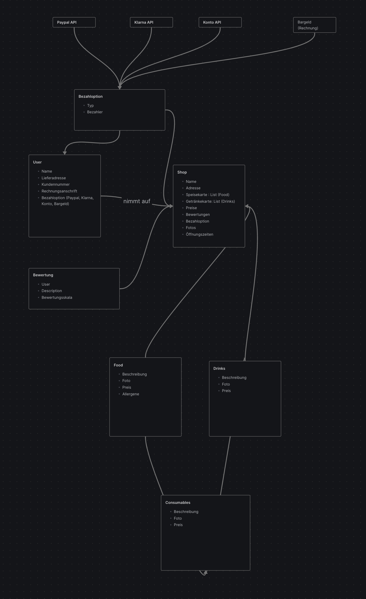

# Lieferdienst 

**Dieses Projekt ist keine allgemeingültige Vorlage**

## Zugehörige Projektdatei (aus dem Workshop)

**Funktionen**
- Map
- Kategorien
- Listen
- Abholen Liefern
- Bewertungen
- Bestell/Bezahlung
- Preise 
- Profil 
- Coupons
- Fotos 

**Einordnung**
- Paying
	- Bezahlung - Service 
	- Preise - Service 
	- Coupons - alles 
- Bestellung
	- Bestellbestätigungen - Presentation
	- Lieferzeit - Service, Presentation
	- Map - Presentation
	- Storno - Service
- Ansicht 
	- Liste - Presentation
	- Kategorien - Data, Application
	- Map - Presentation
	- Fotos - Presentation, Data Layer 
- Profil - alles 
- misc

**Projektstruktur** -> Feature-First
**Datenbank** -> Firebase Cloud Firestore

